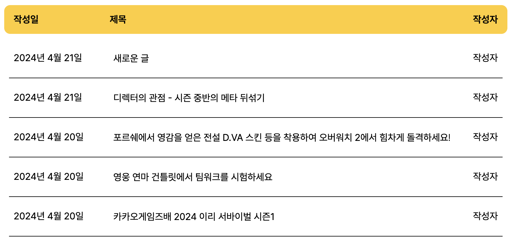

# Pet캠동물병원 인트라넷

## 프로젝트 개요
Pet캠동물병원에서 진료받는 반려동물을 관리하기 위한 동물병원 내부 인트라넷을 제작했습니다.
진료가 필요한 동물을 등록하면 입/퇴원 관리 목록이 표시되고, 해당 반려동물의 자세한 정보와 진료 기록을 확인할 수 있습니다. 동물병원 내부  공지 내용을 공지 사항 페이지에서 파악할 수 있고, 동물을 등록하는 페이지와 진료 현황은 로그인을 통해서만 접근할 수 있습니다. 

#### <u>프로젝트 기간</u> 
2024년 4월 8일 - 21일

#### <u>배포링크</u> 
https://toy2-petcam-vet.web.app/

## 토이프로젝트 2조 소개

<strong>김희준</strong> (https://github.com/PenguinKKIM/) 
프로젝트 관리, 개발 환경 설정 및 배포, 입/퇴원 관리 리스트업
  
<strong>김송희</strong> (https://github.com/lunatokki) 
동물 등록 폼
  
<strong>김희용</strong> (https://github.com/scripto1) 
로그인, 회원가입, 네비게이션 및 푸터
  
<strong>변희준</strong> (http://github.com/hejuby) 
CRUD 게시판
  
<strong>임혜정</strong> (https://github.com/spoonbill40082) 
진료 차트 데이터 끌어오기 및 수정
  

## 기술 스택
   
  

 
 proptypes

## 유저 플로우

## 각 페이지 설명

### A. 개발 환경 설정, 입/퇴원 관리리스트 Firebase에서 불러오기 (김희준)

**느낀점**

저는 조장의 자질은 아닌가봅니다....
고민이 생기면 먼저 혼자 좀 깊은 고민에 빠지는 편인데 바로바로 말 안하는 조장 땜시 팀원 분 들이 고생 하셨을거 같아 너무 죄스럽습니다 ㅠㅠ 그래도 너무 좋은분들 능력자분 들 만나서 재밌게 프로젝트 진행했습니다.
리액트가 어떻게 컴포넌트와 상호작용하고 값을 던저주는지 조금은 더 잘 알게되었습니다.
타입스크립트로 프로젝트를 진행하지는 못 한게 조금 아쉽긴하지만 만약  그랬다면 제 머리가 먼저 터지지 않았을까 싶습니담..
너무너무 좋은 경험 이었습니다 !!

### B. 동물 등록 폼 페이지 (김송희)

**이미지 추가**
- 새로 등록하는 동물들의 사진을 추가하고 삭제할 수 있도록 ``태그와 `<input>`태그를 사용해서 이미지가 출력되는 화면과 이미지파일을 추가하고 삭제할 수 있는 '파일 추가', '삭제'버튼을 만들었습니다.

**동물 정보 작성**
- 동물의 보호자명, 동물이름, 나이, 종, 성별, 중성화여부, 체중을 기입할 수 있는 항목을 만들었습니다. `<input>`태그 이외에 중성화여부나 성별 항목은 `<select>`와 `<option>`을 활용했습니다. 또한 모든 항목을 기입했을 때만 등록이 완료될 수 있도록 했습니다. 빠진 항목이 있으면 등록버튼을 눌렀을 때 '모든 항목을 작성해주세요.'라는 모달 창이 뜨도록 하였습니다. 취소버튼을 눌렀을 때는 사용자가 작성한 내용이 저장되지 않습니다. 
- 등록버튼을 눌러 데이터베이스에 저장된 내용은 수의사가 진료내용을 작성할 때 해당 등록폼의 내용을 불러와서 사용할 수 있습니다. 

**느낀 점**
1. 좋았던 점: 이전 개인과제에서 끝까지 구현하지 못하고 마무리된 부분 때문에 팀에서 한 부분을 맡아서 서비스를 다같이 만들어가는 과정에 스스로의 몫을 잘 해낼 수 있을까 하는 걱정이 앞섰는데 부족하지만 처음으로 뭔가를 윤곽을 잡아서 뚜렷하게 만들었다는 게 뿌듯하고 즐거운 시간이었습니다. 팀원분들이 많이 도와주시고 이것저것 배우고 알게 된 부분들도 많아서 감사했습니다 `:)`
2. 아쉬운 점: 제가 맡은 부분을 한 파일 안에 모든 기능과 스타일드 컴포넌트를 구현한 게 아쉽습니다. 기능을 나눠서 컴포넌트를 작성했으면 더 보기 좋고 편리했을 것 같아요. 추가로 React와 Firebase, 기본적인 자바스크립트에 대해서 더 많이 공부해야 겠다는 생각이 들었습니다. 

### C. 로그인, 회원가입, 네비게이션 및 푸터 (김희용)

**1. 로그인 및 회원가입 페이지**
- 회원가입을 통해 등록한 사용자 정보를 Firebase 인증 서비스(getAuth)를 통해서 로그인 페이지를 구현했습니다. `auth/user-not-found`를 사용해서 등록되지 않은 사용자에게 에러 메시지를 띄웁니다.
- 회원가입을 하지 않고 구글 계정으로 로그인 할 수 있도록 Firebase 구글 로그인 기능`GoogleAuthProvider()`을 적용했습니다. 
- 회원 가입 시 비밀 번호는 여덟 글자 이상, 대소문자, 숫자, 특수문자, 비밀 번호 일치로 유효성 검사를 통과해야 가입이 가능합니다. 이미 등록한 이메일 주소는 가입이 불가능하고, 로그인 상태에서는 '로그인' 버튼이 비활성화됩니다. 

**2. 네비게이션 및 푸터**
- 동물 발바닥 심볼과 따뜻하고 부드러운 서체를 사용해서 Pet캠동물병원 로고를 만들었고, 차분한 회색과 브라운 색상을 페이지 전체에 적용하고 포인트 컬러로 노란색을 지정했습니다. 
- 오른쪽 상단의 '로그인' 버튼은 로그인 상태에서는 '로그아웃'으로 변경되고, 로그인 상태에서만 입/퇴원 관리와 동물 등록 기능이 가능합니다. 
- 각 메뉴 글자 밑에 노란색 선을 배치해서 현재 화면에 나타나는 페이지를 시각적으로 파악할 수 있습니다. 
- 현재 시간을 확인할 수 있는 시계 기능을 추가했습니다.

**3. 토이 프로젝트를 진행하면서 느낀점**
- 패캠 강의장에 옹기종기 모여 피그마에 동시에 접속해서 전체적인 디자인 틀을 빠르게 만들었던 시간이 아직 기억에 남습니다. 개인적으로는 처음 구현하는 로그인 기능이라 조금 더 적극적으로 다른 기능 구현에 도전해 보지 못해서 아쉽습니다.
- 아직 서투르지만 리액트 컴포넌트를 통해 전체 프로젝트 파일을 어떻게 분할하고 관리할 수 있는지 어렴풋이 알 수 있었습니다. useState와 useLocation 등 상위 컴포넌트와 하위 컴포넌트의 상태를 연결하고 관리 할 수 있었고, 페이지 간 라우팅 구조는 어떻게 짜야 하는지 경험할 수 있었습니다. 
- 기본 자바스크립트 논리와 파이어베이스 및 데이터를 주고 받는 모든 과정이 아직은 쉽지 않지만 다음 프로젝트까지 다시 공부하려고 합니다. 
- 경험이 많은 조장님이 이끌어 주셔서 초기 세팅을 쉽게 할 수 있었고, 마지막까지 서로 독려하면서 프로젝트를 마무리 해준 2조 팀원분에게도 감사드립니다.
  

### D. 에디터 라이브러리(TipTap), Firebase Firestore, React Context API, React Router Params를 이용한 CRUD 게시판 구현 (변희준)

 

 

 

### E. 진료를 위해 차트 데이터 끌어오기, 그리고 수정하기 (임혜정)

  

**1. 오늘 진료**

- 각 동물들의 진료를 진행하기 위해 오늘의 진료 목록을 가져올 수 있게 했습니다. 데이터베이스의 진료일과 오늘 날짜를 비교해, 두 정보가 일치하는 경우에만 오늘 진료 목록에 진료받을 동물 이름(그리고 보호자와 진료 시간)을 출력할 수 있게 구성했습니다.
- 오늘 진료 목록 중 하나를 누르면 문서 이름(즉 ID)에 해당하는 데이터가 **차트**와 **진료 내용**에 출력됩니다.
  

**2. 차트**

.gif)
- 차트 컴포넌트에는 오늘 진료 항목에서 선택한 동물의 기본 정보가 출력됩니다. 각 항목은 수정이 가능합니다.
- 맨 위의 '진료 시작' 토글 버튼을 누르면 타이머가 작동합니다. 각 진료에 걸리는 시간을 측정할 수 있습니다(단, 타이머로 측정한 시간은 데이터베이스에 반영되지 않습니다).
- 입원 수속 여부를 정해 날짜를 지정할 수 있습니다. input 태그를 사용해 O에 체크했을 경우에만 입원 날짜 선택 창이 등장합니다. 
  

**3. 진료 내용**

.gif)
- 진료 내용을 수의사가 직접 타이핑해 작성할 수 있습니다. 
- 작성한 내용을 저장하고자 저장 버튼을 누르면 textarea 내부 하단에 타임스탬프가 기록되게 구성했습니다. 이로서 가장 최근에 수정을 한 때가 언제인지 확인할 수 있습니다.
  

#### 어떤 점이 인상 깊었는가? ##
1. **좋았던 점이라면**: 가장 좋은 점은 역시 '나 혼자' 계획을 밀고 나가는 것이 아니라 다른 조원들과 합을 짜며 계획을 차차 실행하고 또 완성되어 가는 모습을 직접 볼 수 있었다는 것입니다. 특히 피그마에서 페이지 디자인을 함께했던 때가 기억나는데요, 과제의 결말이 어떻게 될지 걱정하면서도 어떻게든 적극적으로 참여하려 발언하던 모습이 인상 깊었습니다.
2. **개선하고 싶은 점이라면**: 데이터베이스 다루는 방법을 좀 더 공부하고 싶습니다. 이번 과제에서는 어찌저찌 성공했습니다만 여전히 어딘가 모르게 아쉬운 구석이 있습니다. 또한 이번에는 반응형 CSS를 제대로 적용해 보고자 신경을 썼고, 저번 개인 과제에 비하면 어느 정도 성공적으로 해낼 수 있었으나 여전히 이곳저곳 틀어진 곳이 많습니다. 다음 조별 과제에서는 이번 과제에서의 경험을 바탕으로 실력을 늘려볼 예정입니다.

